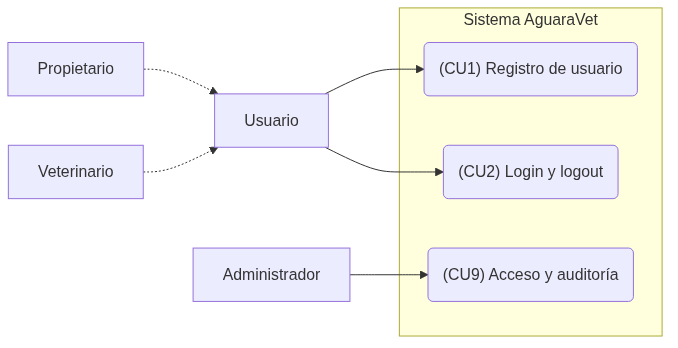
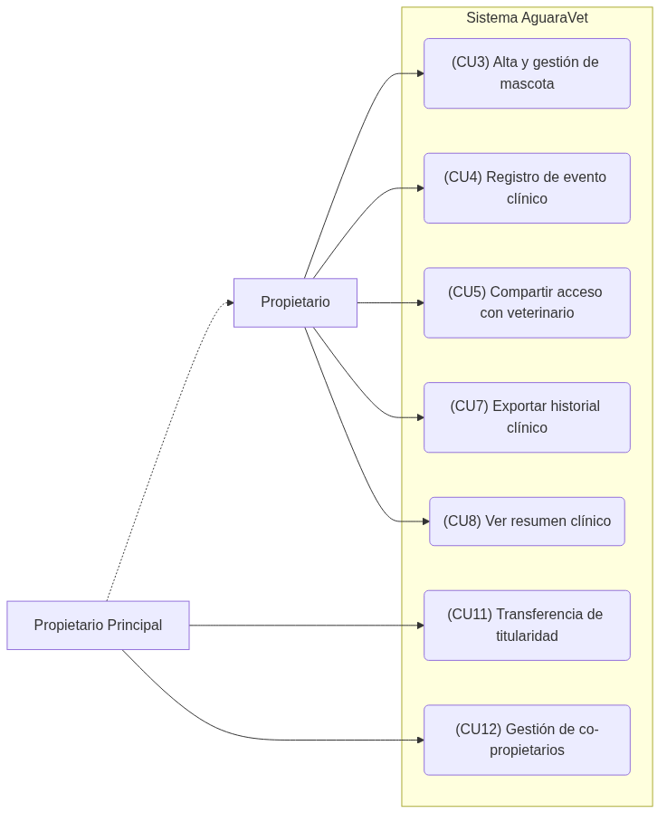
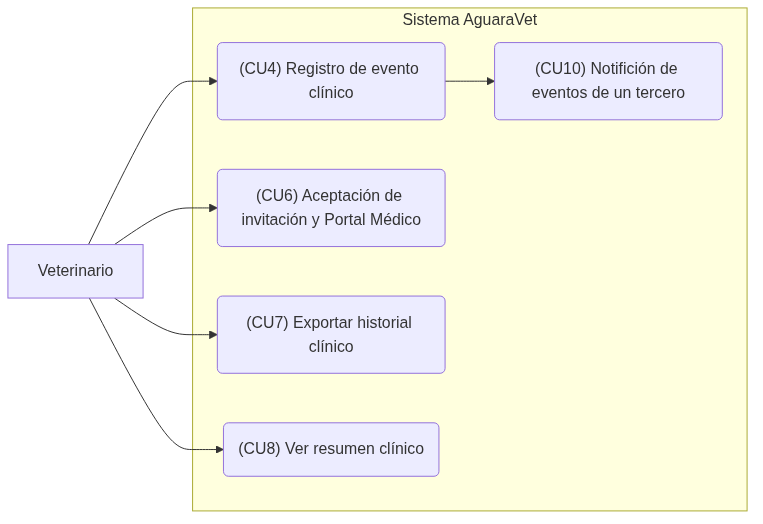

# Casos de Uso

Para detallar el comportamiento y las interacciones de los distintos actores con la plataforma AguaraVet, se definen los siguientes casos de uso, organizados con su correspondiente trazabilidad hacia los requerimientos funcionales (RF).

- CU1: Registro de usuario (RF1)
  - Actor: Usuario no registrado
  - Flujo:
    - Ingreso de datos
    - Validación de unicidad
    - Sistema envía token de confirmación al correo
    - Usuario hace clic en el enlace para activar la cuenta
- CU2: Login y Logout (RF2)
  - Actor: Usuario ya registrado
  - Flujo:
    - Ingreso de credenciales
    - Sistema valida y permite el acceso seguro
    - Permite el cierre de sesión voluntario
- CU3: Alta y gestión de mascotas (RF3)
  - Actor: Usuario Propietario
  - Flujo:
    - Usuario ingresa a Agregar mascota
    - Selecciona Especie y Raza desde un catálogo estandarizado
    - Ingresa datos adicionales y foto
    - Sistema valida (ej. límites por cuenta y tamaño de imagen) y crea el perfil
- CU4: Registro de evento clínico (RF4, RF5)
  - Actor: Usuario Propietario o Veterinario autorizado
  - Flujo:
    - Selección de la mascota
    - Agregar evento
    - Ingresa clasificación (consulta, vacuna, cirugía, etc.), notas y adjuntos
    - Sistema valida extensiones de archivos y guarda el evento con estampa inmutable (autor, fecha, hora)
- CU5: Compartir acceso con veterinario (RF6)
  - Actor: Usuario Propietario
  - Flujo:
    - Selecciona Compartir acceso
    - Ingresa email del veterinario
    - Selecciona nivel de permisos y fecha de expiración
    - Sistema envía invitación
- CU6: Aceptación de invitación y acceso al Portal Médico (RF7)
  - Actor: Usuario Veterinario
  - Flujo:
    - El veterinario recibe el correo de invitación
    - Hace clic en el enlace de aceptación
    - Inicia sesión o se registra
    - El sistema le asocia la mascota correspondiente
    - El veterinario accede a su Portal Médico
- CU7: Exportar historial clínico (RF8)
  - Actor: Usuario Propietario o Veterinario autorizado
  - Flujo:
    - Accede a la ficha de la mascota
    - Selecciona Exportar
    - El sistema genera un PDF y permite la descarga
- CU8: Ver resumen clínico (RF9)
  - Actor: Usuario Propietario o Veterinario autorizado
  - Flujo:
    - Acceso a ficha de mascota
    - El sistema carga dashboard rápido mostrando vacunas pendientes, alertas automáticas según especie, alergias y medicación activa
- CU9: Acceso y auditoría (RF10)
  - Actor: Usuario Administrador del sistema
  - Flujo:
    - Acceso a panel de control
    - Visualización de un log inmutable de todas las acciones sobre registros médicos (accesos a ficha, exportaciones, modificaciones de acceso)
- CU10: Notificación de eventos de un tercero (RF11)
  - Actor: Usuario Veterinario (emisor) y Propietario (receptor)
  - Flujo:
    - Veterinario ingresa evento (CU4)
    - Guarda
    - Sistema dispara un Job en Redis
    - Notificación/Email llega al propietario alertando de la novedad en el historial de su mascota
- CU11: Transferencia de titularidad (RF12)
  - Actor: Usuario Propietario Principal
  - Flujo:
    - Usuario ingresa a la mascota
    - Inicia Transferir Mascota
    - Ingresa email del receptor
    - Receptor recibe email/notificación
    - Receptor acepta
    - El sistema reasigna el owner_id de la mascota en PostgreSQL y notifica al dueño original
- CU12: Gestión de co-propietarios (múltiples dueños) (RF13)
  - Actor: Usuario Propietario Principal
  - Flujo:
    - Propietario Principal accede a configuración de mascota
    - Selecciona Agregar co-propietario
    - Ingresa el correo electrónico del otro usuario
    - El sistema asocia al co-propietario con permisos de gestión compartida

## Diagramas

