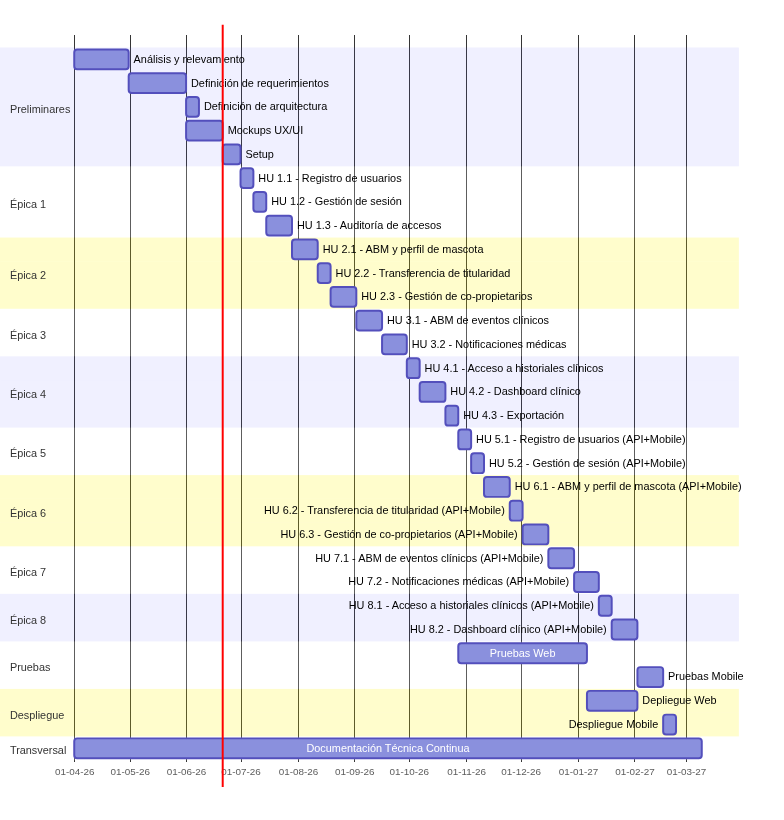

# Planificación del Proyecto

En esta sección se presenta el desglose estructurado del proyecto en componentes ágiles (Épicas, Historias de Usuario y Tareas), garantizando la trazabilidad con los Requerimientos Funcionales (RF), Requerimientos No Funcionales (RNF) y Casos de Uso (CU).

## Épica 1: Gestión de Usuarios

### HU 1.1: Registro de usuarios

Como **nuevo usuario** (propietario o veterinario), quiero **registrarme con mi correo electrónico**, para **crear mi cuenta y acceder a la plataforma de gestión.**

- **Criterios de Aceptación:**
  - El sistema debe validar que el email no exista previamente.
  - La contraseña debe cumplir reglas de seguridad fuerte (mínimo 8 caracteres, alfanumérico).
  - El sistema debe enviar un enlace único de confirmación al correo brindado.
  - El sistema debe restringir el acceso al dashboard hasta que el usuario haya confirmado su dirección de correo electrónico.

- **Trazabilidad:** RF1, RNF-SEG-1, RNF-SEG-3, CU1

- **Tareas Técnicas:**
  - Crear migraciones y modelos de usuario en Laravel 12.
  - Implementar controlador de registro reactivo (Livewire).
  - Configurar notificaciones por correo electrónico mediante colas en Redis y plantillas Blade.

### HU 1.2: Gestión de sesión

Como **usuario registrado**, quiero **iniciar y cerrar sesión en el sistema**, para **operar de forma segura protegiendo la confidencialidad de los datos médicos.**

- **Criterios de Aceptación:**
  - El acceso solo se otorgará con credenciales válidas y cuenta confirmada.
  - Tras 5 intentos fallidos de contraseña en un minuto, la IP/cuenta será bloqueada temporalmente por el sistema.
  - La sesión expirará obligatoriamente tras 60 minutos de inactividad en la web.

- **Trazabilidad:** RF2, RNF-SEG-3, RNF-SEG-4, CU2

- **Tareas Técnicas:**
  - Configurar middlewares de sesión y expiración en Laravel 12.
  - Implementar limitador de peticiones (*Rate Limiting*) en las rutas de inicio de sesión.

### HU 1.3: Panel de Auditoría

Como **administrador del sistema**, quiero **visualizar un log inmutable de accesos y modificaciones**, para **auditar la seguridad de la información clínica.**

- **Criterios de Aceptación:**
  - El sistema debe registrar cada inicio de sesión, exportación de historias clínicas y cambios en permisos de compartición de forma automática.
  - El log debe ser de solo lectura (inmutable) y estar restringido únicamente a usuarios con rol de administrador.
  - Las búsquedas en el log deben poder filtrarse por rango de fechas, usuario y tipo de acción.

- **Trazabilidad:** RF10, RNF-PRI-1, RNF-SEG-1, CU9

- **Tareas Técnicas:**
  - Crear tabla de auditoría en la base de datos.
  - Implementar listeners o middleware globales de Laravel para capturar eventos de accesos y mutaciones críticas.
  - Desarrollar la interfaz web (Livewire) para la visualización y filtrado de logs exclusiva para administradores.

## Épica 2: Gestión de Mascotas

### HU 2.1: ABM y Perfil de la Mascota

Como **propietario**, quiero **dar de alta el perfil de mi mascota usando un catálogo predefinido de razas**, para **iniciar su trazabilidad médica de forma estandarizada.**

- **Criterios de Aceptación:**
  - Los campos de Especie y Raza deben ser desplegables nutridos de tablas maestras en la base de datos.
  - Debe permitir cargar una foto de perfil validando que sea menor a 5MB. Las imágenes más grandes serán rechazadas.
  - El procesamiento y redimensionado de las imágenes se realizará en segundo plano.

- **Trazabilidad:** RF3, RNF-REN-2, RNF-USA-1, CU3

- **Tareas Técnicas:**
  - Crear catálogo maestro (Seeders de especies/razas comunes).
  - Integrar Spatie Media Library para el manejo de avatares y archivos adjuntos.
  - Desarrollar formulario Livewire con validación en tiempo real.

### HU 2.2: Transferencia de Titularidad

Como **propietario principal**, quiero **poder transferir la titularidad de mi mascota a otro usuario de la plataforma**, para **delegar el control absoluto de su historia clínica en casos de adopción.**

- **Criterios de Aceptación:**
  - El usuario debe poder ingresar el correo del nuevo dueño.
  - El sistema debe generar un flujo de aceptación (el receptor debe aceptar la transferencia).
  - Una vez aceptada, el dueño anterior pierde permisos administrativos.

- **Trazabilidad:** RF12, RNF-PRI-1, RNF-PRI-2, CU11

- **Tareas Técnicas:**
  - Implementar lógica para reasignar tras confirmación.
  - Diseñar notificaciones para la invitación de transferencia y la aceptación por parte del receptor.

### HU 2.3: Gestión de Co-propietarios

Como **propietario principal**, quiero **asociar co-propietarios a la ficha de mi mascota**, para **compartir la gestión de su información y los permisos administrativos de forma colaborativa.**

- **Criterios de Aceptación:**
  - El propietario principal debe poder agregar a otro usuario registrado como co-propietario mediante su dirección de correo electrónico.
  - Los co-propietarios tienen permisos para ver, editar y agregar eventos clínicos, pero no pueden transferir la titularidad ni eliminar la mascota.
  - El sistema debe validar que solo el propietario principal tenga acceso a las opciones de eliminación y transferencia de titularidad.

- **Trazabilidad:** RF13, RNF-PRI-2, RNF-PRI-3, CU12

- **Tareas Técnicas:**
  - Crear tabla pivote para registrar la co-propiedad.
  - Implementar Laravel Policies para restringir y diferenciar las acciones de Propietario Principal frente a Co-propietarios.

## Épica 3: Historial Clínico y Trazabilidad Médica

### HU 3.1: ABM de eventos clínicos

Como **usuario autorizado** (propietario o veterinario), quiero **registrar un evento médico y adjuntar estudios**, para **mantener la historia de salud actualizada y cronológica.**

- **Criterios de Aceptación:**
  - El usuario debe clasificar el evento (vacuna, consulta, cirugía, etc.).
  - Se validará que los adjuntos sean exclusivamente PDF, JPG o PNG.
  - El evento guardado llevará automáticamente la firma inmutable del autor (ID del usuario) y fecha/hora del servidor.
  - Cualquier edición o borrado lógico deberá dejar un registro de la versión anterior en la tabla de auditoría.

- **Trazabilidad:** RF4, RF5, RNF-PRI-1, RNF-REN-2, CU4

- **Tareas Técnicas:**
  - Migrar tablas de historial médico y adjuntos.
  - Implementar un observador (*Observer*) en Eloquent o un sistema de Logs de Auditoría para la inmutabilidad de registros.
  - Subida asíncrona de archivos hacia almacenamiento mediante colas en Redis.

### HU 3.2: Notificaciones Médicas

Como **propietario de la mascota**, quiero **recibir una notificación automática si un veterinario añade un evento**, para **monitorear los cambios en el historial de forma proactiva.**

- **Criterios de Aceptación:**
  - Si el autor de un nuevo evento no es el dueño de la mascota, el sistema encolará un aviso por correo electrónico.
  - Se especificará el nombre del veterinario, la clínica y la fecha del evento.

- **Trazabilidad:** RF11, RNF-ESC-2, CU10

- **Tareas Técnicas:**
  - Desarrollar clase Mailable de Laravel y despacharla de forma asíncrona mediante el sistema de colas en Redis.

## Épica 4: Colaboración, Resumen y Portabilidad

### HU 4.1: Compartir historiales clínicos

Como **propietario**, quiero **invitar a un veterinario a visualizar la ficha indicando su nivel de permiso**, para **permitirle consultarla sin perder yo el control de los datos.**

- **Criterios de Aceptación:**
  - El propietario ingresará el correo del veterinario e indicará si tiene acceso de *Solo Lectura* o *Lectura y Escritura*.
  - Se podrá especificar opcionalmente una fecha de expiración del acceso (ej. válido por 7 días).
  - El veterinario solo tendrá acceso a las mascotas específicas a las que fue invitado.

- **Trazabilidad:** RF6, RF7, RNF-PRI-2, RNF-PRI-3, CU5, CU6

- **Tareas Técnicas:**
  - Crear tabla pivote para modelar permisos temporales de terceros.
  - Creación de Laravel Policies estrictas (`view`, `update`, `createMedicalRecord`) validadas en cada request a nivel de base de datos.

### HU 4.2: Tablero de Resumen Clínico

Como **usuario autorizado**, quiero **ver un resumen de la ficha con alertas y datos clave**, para **conocer el estado general de la mascota sin leer toda la historia.**

- **Criterios de Aceptación:**
  - El tablero se cargará de forma asíncrona sin bloquear la UI.
  - Habrá indicadores visuales si existen alertas sanitarias pendientes.
  - Filtro cronológico de eventos reactivo y sin recargas de página.

- **Trazabilidad:** RF9, RNF-REN-1, RNF-USA-2, CU8

- **Tareas Técnicas:**
  - Componente Livewire avanzado para el renderizado del Dashboard.

### HU 4.3: Exportación Verificada de Historial

Como **propietario**, quiero **descargar toda la historia en un PDF oficial**, para **imprimirla o enviarla a instituciones que no usen la plataforma.**

- **Criterios de Aceptación:**
  - La exportación unificará todos los eventos cronológicamente.

- **Trazabilidad:** RF8, RNF-ESC-2, RNF-COM-2, CU7

- **Tareas Técnicas:**
  - Configurar generador de PDF en Laravel (Browsershot o DomPDF).
  - Despacho a colas para su generación pesada si el historial es grande.

## Épica 5: Gestión Usuarios - Mobile

### HU 5.1: Registro usuarios

Esta historia representa a la versión *mobile* de la historia de usuario **HU 1.1**. Los criterios de aceptación y trazabilidad son compatibles con el caso previo.

- **Tareas Técnicas - API:**
  - Crear endpoints `POST /api/v1/auth/register` con validación estricta mediante *Form Requests*.
  - Implementar *API Resources* para estandarizar la respuesta JSON del usuario creado.

- **Tareas Técnicas - Android:**
  - Diseñar la interfaz de la pantalla de Registro con validaciones de UI en tiempo real (formato de email y fuerza de contraseña).
  - Configurar y probar la comunicación con el endpoint.

### HU 5.2: Gestión de sesión

Esta historia representa a la versión *mobile* de la historia de usuario **HU 1.2**. Los criterios de aceptación y trazabilidad son compatibles con el caso previo.

- **Tareas Técnicas - API:**
  - Crear endpoint `POST /api/v1/auth/login` utilizando **Laravel Sanctum** para la emisión de tokens de texto plano (*Bearer Tokens*).
  - Crear endpoint `POST /api/v1/auth/logout` para revocar y destruir el token activo del usuario.
  - Aplicar el middleware de *Rate Limiting* exclusivo para los endpoints de autenticación móvil.

- **Tareas Técnicas - Android:**
  - Diseñar la pantalla de Login con persistencia de estado mediante *ViewModel*.
  - Implementar el almacenamiento seguro del *Access Token*.

## Épica 6: Gestión de Mascotas - Mobile

### HU 6.1: ABM y Perfil de la Mascota

Esta historia representa a la versión *mobile* de la historia de usuario **HU 2.1**. Los criterios de aceptación y trazabilidad son compatibles con el caso previo.

- **Tareas Técnicas - API:**
  - Crear endpoint `POST /api/v1/pets` que acepte peticiones para la recepción de los datos del animal y el archivo de la foto de perfil.

- **Tareas Técnicas - Android:**
  - Diseñar el formulario de Alta de Mascota utilizando selectores desplegables dinámicos.
  - Integrar solución para que el usuario seleccione fotos de la galería o use la cámara de forma segura.
  - Generar una rutina para la compresión y redimensionado de imágenes en el dispositivo antes de realizar el *upload* hacia la API.

### HU 6.2: Transferencia de Titularidad

Esta historia representa a la versión *mobile* de la historia de usuario **HU 2.2**. Los criterios de aceptación y trazabilidad son compatibles con el caso previo.

- **Tareas Técnicas - API:**
  - Crear endpoints `POST /api/v1/pets/{id}/transfer` (para iniciar el proceso) y `POST /api/v1/transfers/{id}/respond` (para aceptar o rechazar la solicitud).

- **Tareas Técnicas - Android:**
  - Diseñar un diálogo modal de confirmación para iniciar la transferencia introduciendo el correo del destinatario.
  - Implementar una sección de *Notificaciones/Alertas de Acción* dentro de la app para que el usuario receptor pueda pulsar botones de *Aceptar* o *Rechazar* de forma directa.

### HU 6.3: Gestión de Co-propietarios

Esta historia representa a la versión *mobile* de la historia de usuario **HU 2.3**. Los criterios de aceptación y trazabilidad son compatibles con el caso previo.

- **Tareas Técnicas - API:**
  - Crear endpoint `POST /api/v1/pets/{id}/co-owners` para la adición de colaboradores.
  - Crear endpoint `DELETE /api/v1/pets/{id}/co-owners/{user_id}` para la remoción de colaboradores.
  - Asegurar que las *Laravel Policies* devuelvan un error `403 Forbidden` si un co-propietario intenta realizar estas acciones desde la API.

- **Tareas Técnicas - Android:**
  - Desarrollar la interfaz *Gestionar Acceso Familiar* dentro de los detalles de la mascota, mostrando la lista de co-propietarios vigentes con elementos interactivos de borrado (deshabilitados visualmente mediante lógica de UI si el usuario actual no es el dueño principal).

## Épica 7: Historial Clínico y Trazabilidad Médica - Mobile

### HU 7.1: ABM de eventos clínicos

Esta historia representa a la versión *mobile* de la historia de usuario **HU 3.1**. Los criterios de aceptación y trazabilidad son compatibles con el caso previo.

- **Tareas Técnicas - API:**
  - Crear endpoint `POST /api/v1/pets/{id}/medical-records` configurado para procesar arreglos de archivos binarios (*Multi-file Upload*).
  - Crear endpoint `GET /api/v1/pets/{id}/medical-records` para listar la historia clínica cronológica adaptada al formato móvil.

- **Tareas Técnicas - Android:**
  - Diseñar la pantalla de inserción de eventos médicos con selectores de categoría y un gestor visual de adjuntos.

### HU 7.2: Notificaciones Médicas

Esta historia representa a la versión *mobile* de la historia de usuario **HU 3.2**. Los criterios de aceptación y trazabilidad son compatibles con el caso previo.

- **Tareas Técnicas - API:**
  - Configurar canales de salida en la API para enviar notificaciones *Push* además del correo electrónico.

- **Tareas Técnicas - Android:**
  - Crear un servicio nativo para procesar las notificaciones en segundo plano y generar alertas visuales en la barra de estado del sistema Android.

## Épica 8: Colaboración, Resumen y Portabilidad - Mobile

### HU 8.1: Compartir historiales clínicos

Esta historia representa a la versión *mobile* de la historia de usuario **HU 4.1**. Los criterios de aceptación y trazabilidad son compatibles con el caso previo.

- **Tareas Técnicas - API:**
  - Crear endpoint `POST /api/v1/pets/{id}/shares` que reciba el alcance de permisos (`read`, `write`) y la expiración.

- **Tareas Técnicas - Android:**
  - Diseñar la interfaz de "Permisos a Terceros" con interruptores (*Switch*) para definir los accesos y un selector de fecha nativo de Android (*DatePicker Dialog*) para delimitar la expiración temporal.

### HU 8.2: Tablero de Resumen Clínico

Esta historia representa a la versión *mobile* de la historia de usuario **HU 4.2**. Los criterios de aceptación y trazabilidad son compatibles con el caso previo.

- **Tareas Técnicas - API:**
  - Crear un endpoint optimizado `GET /api/v1/pets/{id}/dashboard-summary`.

- **Tareas Técnicas - Android:**
  - Diseñar el Dashboard de la Mascota usando componentes de tarjetas (*Card*) con estados reactivos (Alertas en rojo/amarillo).

## Gantt

